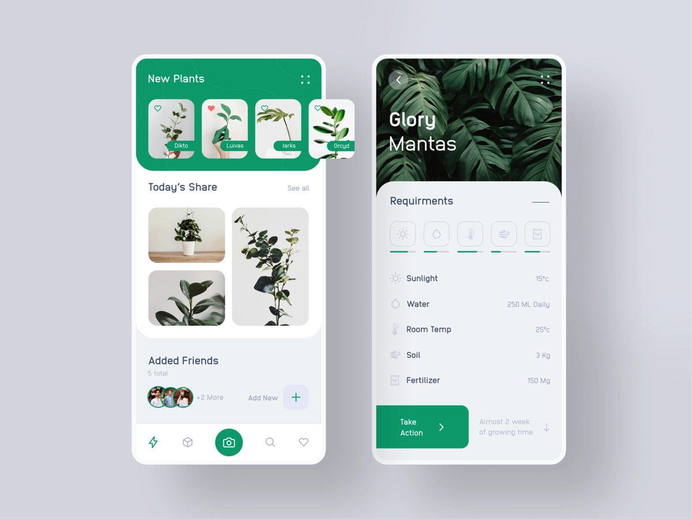
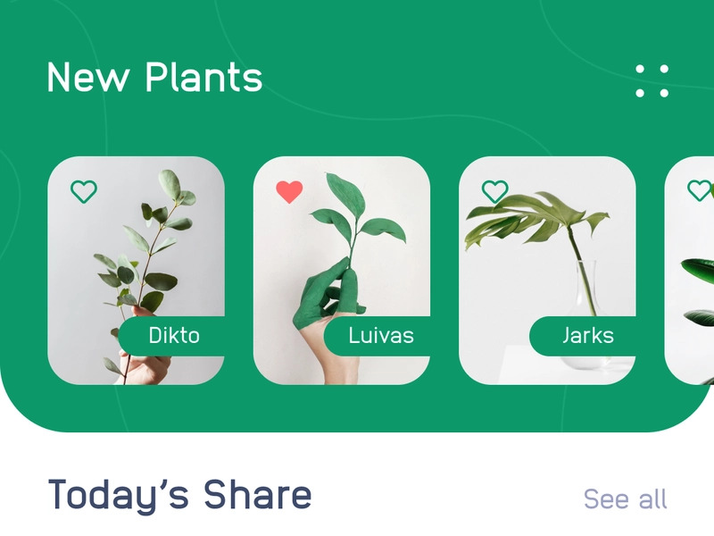
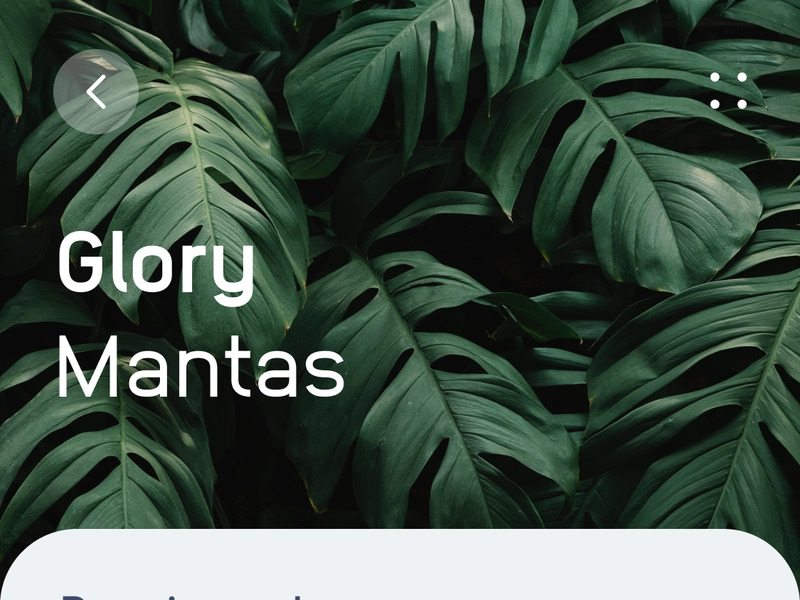

# Plant App Project (Personal Study Project React Native UI)

## About the project

Application to support take care of plant. The current project only includes UI 2 main screens, Home and Plant Detail. Other screens are in the process of being designed and converted.

## System requirements

Android: Android 4.0+ (best with 8.1+)

## Design File

## Some Screenshots

<!-- ## Download and installing

Current version: 1.0.0

Download at folder: \Release -->

## Technology used

Language: Javascript

Frontend: React Native

<!-- Backend: NodeJs (ExpressJs)

Database: MongoDB (Mongo Atlas)

Server deploy: Heroku

Server stores files and images: Cloudinary -->

## Member

[@nguyenvantinh06](https://github.com/nguyenvantinh06)
